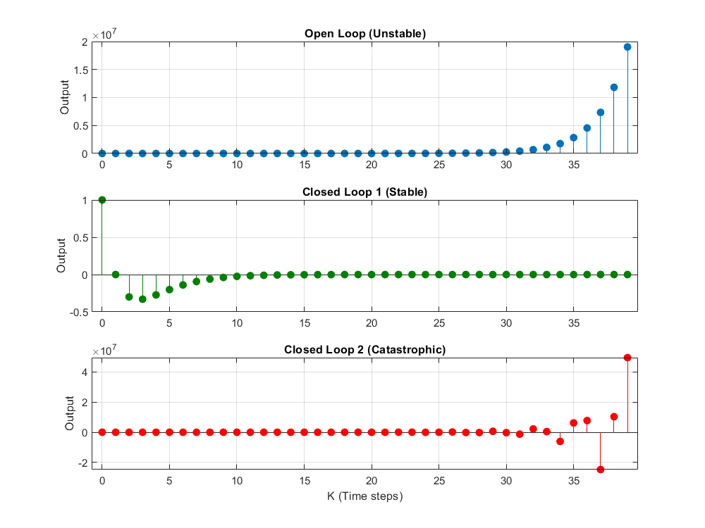

# Control-System-Stability-Analysis
Control System Stability: 
MATLAB to C++ ImplementationThis repository demonstrates the design, simulation, and implementation of a discrete-time controller. It highlights the difference between an unstable open-loop system, a stabilized closed-loop system, and the risks of incorrect controller gains.

Project Structure
  /matlab: Contains the .m scripts used for initial system modeling and gain selection.
  /cpp: Contains the high-performance C++ implementation of the control logic.

The Control Problem 
  We model a second-order unstable system defined by the difference equation: y[k+1] = 1.3y[k] + 0.5y[k-1] + u[k] Without control (u=0), the system's poles lie outside the unit circle, causing the output to diverge (explode) rapidly. 

Scenarios Simulated:
  Open Loop: No control input. The system is naturally unstable.
  Stable Control: Using state-feedback gains (k_1=0.2, k_2=0.8) to pull the eigenvalues inside the unit circle.
  Catastrophic Control: Demonstrating how aggressive or "wrong" gains (k_1=2.5, k_2=3.0) can destabilize the system even further than the open-loop case.

Technical Implementation
  MATLAB PrototypeThe MATLAB code allows for quick iteration of gains and provides high-fidelity plotting to visualize the settling time and overshoot. 
  C++ Implementation The C++ code (unstable_example.cpp) translates the mathematical model into a computationally efficient loop.
  State Space: The system is converted to state-space form where x_1 = y[k] and x_2 = y[k-1].

Performance: Ideal for embedded applications where MATLAB's overhead is not permitted.

How to UseRun MATLAB: Open /matlab/your_script.m to see the theoretical response.
Compile C++: Bashg++ cpp/unstable_example.cpp -o control_sim
Generate Data: Run the simulation and pipe the results to a CSV for analysis:Bash./control_sim > results.csv

Name it results_plot.png. Then, you can add this line to your README to show the results immediately to anyone visiting:
